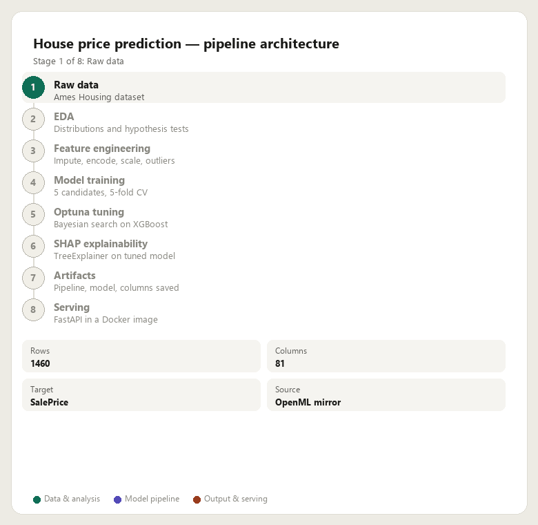
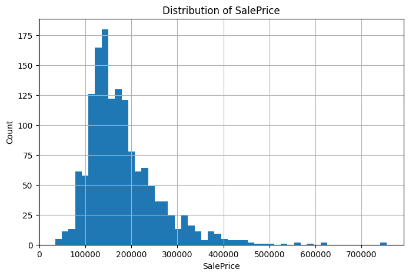
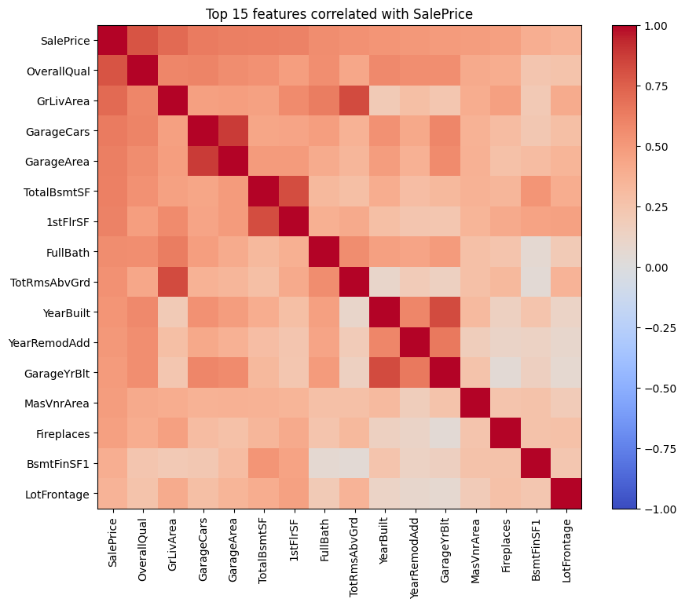
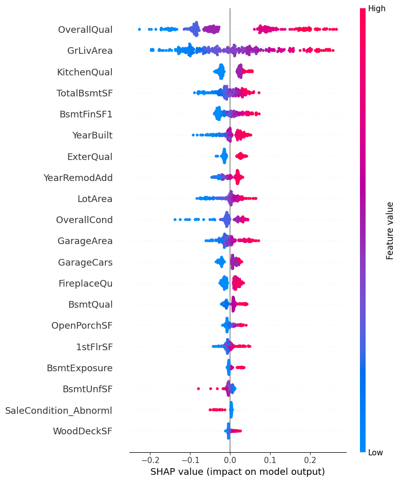
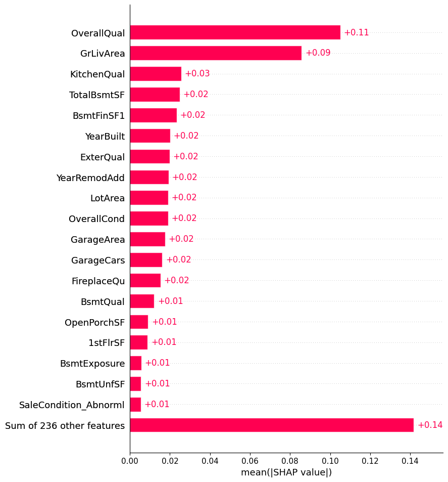

# Project 1: House Price Prediction — Full ML Pipeline

## Problem Statement

Given structural, quality, and location features of a home, predict its sale price.
This is the classic Kaggle "House Prices — Advanced Regression Techniques" competition
dataset (Ames, Iowa; De Cock, 2011): 1460 training rows, 79 raw features spanning lot
size, quality ratings, basement/garage details, and neighborhood. It's a good baseline
project because it forces the full regression lifecycle — skewed target, mixed
numeric/categorical/ordinal features, meaningful missingness, and real outliers — without
needing anything beyond classical ML.

Full task breakdown: [Project 1 checklist](../Checklist/project_1.md). Longer discussion
of design decisions and tradeoffs: [docs/WRITEUP.md](docs/WRITEUP.md).

## Architecture

```mermaid
flowchart LR
    A[Kaggle Ames Housing\n(OpenML fallback, no creds needed)] --> B[EDA\nmissing values, distributions,\nhypothesis tests, CIs]
    B --> C[Feature Engineering\ndomain imputation, ordinal +\none-hot encoding, scaling,\noutlier removal]
    C --> D[Model Training\nLinear/Ridge/Lasso/RF/XGBoost\n5-fold CV, log1p target]
    D --> E[Optuna Tuning\nBayesian search, XGBoost]
    E --> F[SHAP Explainability\nTreeExplainer]
    D --> G[artifacts/\npipeline + model + feature_columns]
    G --> H[FastAPI /predict]
    H --> I[Docker image\nmodel trained at build time]
    I --> J[Railway / Render]
```

The feature pipeline is fit once on the training split and persisted (`artifacts/`), so the
exact same imputation/encoding/scaling is replayed at inference time — no train/serve skew.

For a clickable, animated version of this diagram — step through each stage and see the real
metrics produced at that point — open [`docs/architecture.html`](docs/architecture.html)
directly in a browser (no server needed).



## Results

Test-set metrics (20% holdout, 5-fold CV for the mean/std columns), predictions trained on
`log1p(SalePrice)` and inverse-transformed before scoring:

| Model | CV RMSE (log) | Test MAE | Test RMSE | Test R² |
|---|---|---|---|---|
| **Lasso** | 0.114 ± 0.009 | **$14,083** | **$19,422** | **0.932** |
| Ridge | 0.114 ± 0.010 | $14,489 | $20,183 | 0.926 |
| XGBoost (Optuna-tuned) | 0.119 | $14,409 | $20,120 | 0.927 |
| XGBoost (baseline) | 0.121 ± 0.010 | $14,773 | $20,236 | 0.926 |
| LinearRegression | 0.127 ± 0.013 | $15,493 | $22,045 | 0.912 |
| RandomForest | 0.140 ± 0.011 | $16,448 | $24,128 | 0.895 |

**Before/after tuning (XGBoost, the model served by the API):** Optuna's 30-trial Bayesian
search improved test MAE from $14,773 → $14,409 (−2.5%) and RMSE from $20,236 → $20,120,
by finding a shallower, lower-learning-rate config (`max_depth=4`, `learning_rate=0.026`,
`n_estimators=544`) than the untuned defaults.

Regularized linear models (Lasso/Ridge) actually beat every tree ensemble on this dataset —
see [docs/WRITEUP.md](docs/WRITEUP.md) for why, and why XGBoost is still what's served.

 

### Explainability

SHAP (TreeExplainer on the tuned XGBoost model) confirms the EDA findings: `OverallQual`
and `GrLivArea` dominate, consistent with the §1.3 hypothesis tests during EDA (`OverallQual`
correlated with `SalePrice` at r=0.79, p≈0; homes with central air averaged $186k vs $105k
without, t=17.3).

 

## Structure

```
src/house_price/
  data/       # loading raw data
  features/   # feature engineering (missing values, outliers, encoding, scaling)
  models/     # training, CV, Optuna tuning
  api/        # FastAPI app
  eda.py      # EDA plots
  stats.py    # hypothesis tests, confidence intervals
  explain.py  # SHAP
scripts/      # run_eda.py, run_training.py, run_explainability.py
tests/        # pytest suite (36 tests)
docs/         # write-up + curated result images
data/         # raw/processed data (gitignored contents)
artifacts/    # trained pipeline/model (gitignored, generated by run_training.py)
```

## Setup

```bash
pip install -r requirements.txt
pip install -e .
```

## Run tests

```bash
pytest
```

## Run API

```bash
python scripts/run_training.py   # trains models and saves artifacts/ (pipeline, model, feature columns)
uvicorn house_price.api.main:app --reload
```

```bash
curl -X POST http://localhost:8000/predict \
  -H "Content-Type: application/json" \
  -d '{"OverallQual": 7, "GrLivArea": 1800, "Neighborhood": "NAmes"}'
```

Any subset of the training columns is accepted; omitted fields are imputed the same way
missing values were handled during training.

## Docker

```bash
docker build -t house-price-api .
docker run -p 8000:8000 house-price-api
```

The image trains a model at build time (`OPTUNA_TRIALS=15`, kept low for build speed) so the
container is self-contained — no external artifact store needed.

## Deploy (Railway / Render)

This project lives in a subdirectory of a monorepo, so when connecting the repo you must set
the service's **root directory** to `project-1-house-price-prediction` — otherwise the platform
won't find the `Dockerfile`.

**Render:**
1. New → Web Service → connect the `ml-systems` GitHub repo
2. Root Directory: `project-1-house-price-prediction`
3. Environment: Docker (auto-detected from the `Dockerfile`)
4. Instance type: Free
5. Deploy — Render builds the image (runs training) and exposes the service on its assigned URL

**Railway:**
1. New Project → Deploy from GitHub repo → select `ml-systems`
2. Settings → Root Directory: `project-1-house-price-prediction`
3. Railway detects the `Dockerfile` automatically and builds/deploys
4. Add a public domain under Settings → Networking

Both require your own account connected to GitHub — deployment itself isn't something that can
be scripted from here.
