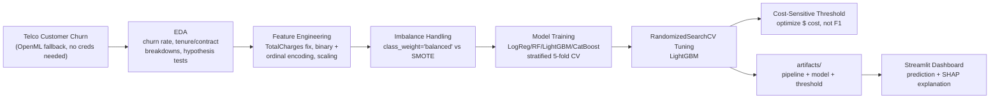
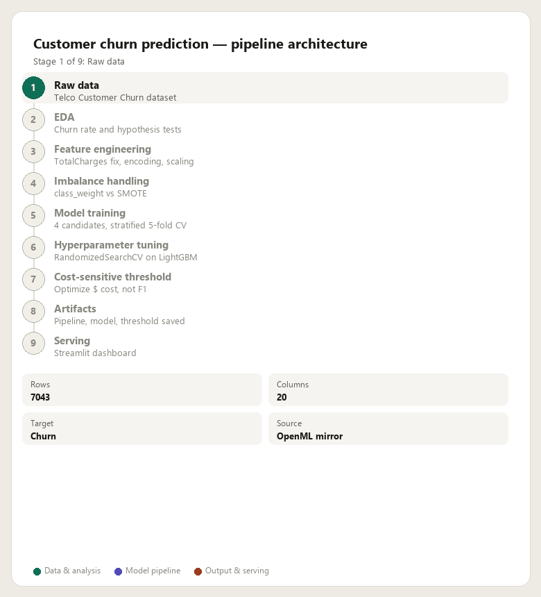
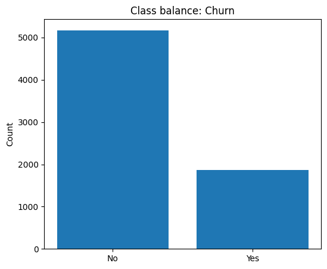
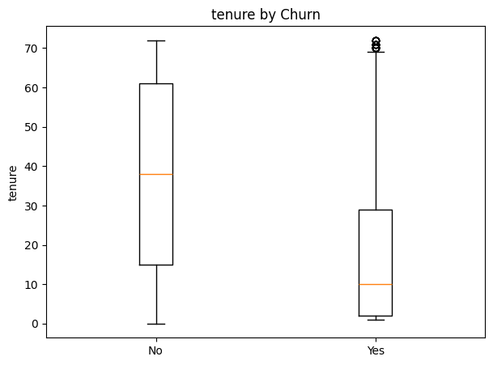
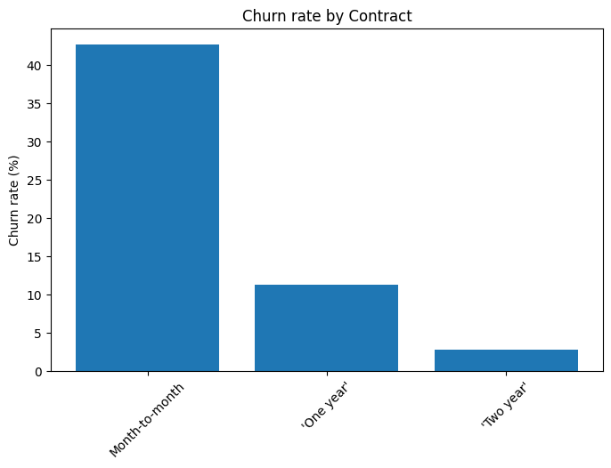
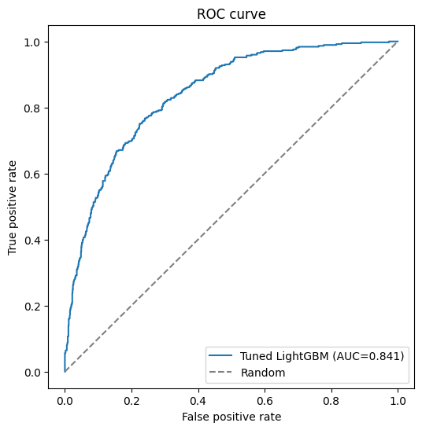
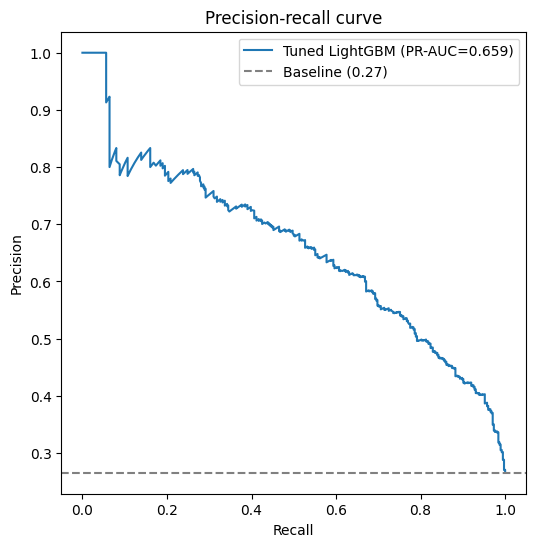

# Project 2: Customer Churn Prediction with Imbalanced Data

## Problem Statement

Predict which telecom customers are about to cancel their service (churn), using account
and service details -- tenure, contract type, monthly charges, and which add-ons they've
subscribed to. This is the IBM Telco Customer Churn dataset: 7043 customers, 26.5% churn
rate. The interesting part isn't the classifier itself -- it's everything imbalanced
classification requires beyond "call `.fit()`": handling a minority class properly,
choosing a decision threshold deliberately instead of defaulting to 0.5, and translating
model output into a business cost/benefit tradeoff a non-ML stakeholder would actually act on.

Full task breakdown: [Project 2 checklist](../Checklist/project_2.md). Longer discussion
of design decisions and tradeoffs: [docs/WRITEUP.md](docs/WRITEUP.md).

## Architecture



The feature pipeline is fit once on the training split and persisted (`artifacts/`), so the
exact same imputation/encoding/scaling is replayed at inference time in the dashboard.



## Results

Test-set metrics (20% stratified holdout, 5-fold stratified CV for the CV column):

| Model | CV ROC-AUC | Precision | Recall | F1 | ROC-AUC | PR-AUC |
|---|---|---|---|---|---|---|
| LogisticRegression | 0.840 ± 0.014 | 0.584 | 0.671 | 0.624 | 0.837 | 0.629 |
| CatBoost | 0.837 ± 0.011 | 0.491 | **0.813** | 0.612 | 0.828 | **0.647** |
| LightGBM (baseline) | 0.831 ± 0.011 | 0.515 | 0.757 | 0.613 | 0.826 | 0.636 |
| RandomForest | 0.812 ± 0.011 | 0.512 | 0.727 | 0.601 | 0.812 | 0.611 |
| **LightGBM (tuned)** | **0.843** | **0.607** | 0.666 | **0.635** | **0.841** | -- |

**Before/after tuning:** RandomizedSearchCV (30 iterations, stratified 5-fold, optimizing
ROC-AUC) improved LightGBM's test ROC-AUC from 0.826 → 0.841 and F1 from 0.613 → 0.635, by
finding a shallower tree (`max_depth=2` vs deeper defaults) with more, smaller boosting
rounds (`n_estimators=443`, `learning_rate=0.032`) -- the same "more small steps beats fewer
big ones" pattern that showed up tuning XGBoost in Project 1.

**Before/after imbalance strategy** (same tuned architecture): `class_weight='balanced'`
scored ROC-AUC=0.841 (Precision 0.607, Recall 0.666); SMOTE oversampling scored ROC-AUC=0.839
(Precision 0.533, Recall 0.759) -- SMOTE trades precision for recall, catching more churners
at the cost of more false alarms. Neither is "correct" in isolation; which one wins depends
on the cost of a false positive vs a false negative (see below).

  

 

### Business interpretation: the F1-optimal threshold isn't the cost-optimal one

Using illustrative cost assumptions (a $50 retention offer, $800 lifetime value per churner,
a 50% retention-offer success rate) on the tuned LightGBM model's test-set probabilities:

| Threshold | Value | Total cost | TP | FP | FN |
|---|---|---|---|---|---|
| Default | 0.50 | $210,500 | 296 | 298 | 78 |
| F1-optimal | 0.64 | $220,100 | 249 | 161 | 125 |
| **Cost-optimal** | **0.23** | **$201,250** | 356 | 533 | 18 |

The F1-optimal threshold actually costs **more** than the naive default -- it's tuned for a
metric that doesn't know a missed churner costs 16x more than an unnecessary retention offer.
The cost-optimal threshold saves $9,250 (4.4%) versus the default by deliberately accepting far
more false positives to avoid missing churners. See [docs/WRITEUP.md](docs/WRITEUP.md) for the
full reasoning and the caveat that these dollar figures are illustrative, not fitted.

## Structure

```
src/churn_prediction/
  data/       # loading raw data
  features/   # feature engineering, imbalance handling
  models/     # training, CV, RandomizedSearchCV tuning
  eda.py      # EDA plots
  stats.py    # hypothesis tests, confidence intervals
  evaluate.py # classification metrics, ROC/PR/learning curves
  business.py # cost-sensitive threshold selection
  dashboard.py # Streamlit UI + prediction/explanation helpers
scripts/      # run_eda.py, run_training.py
streamlit_app.py  # entry point: `streamlit run streamlit_app.py`
tests/        # pytest suite (31 tests)
docs/         # write-up + curated result images
data/         # raw/processed data (gitignored contents)
artifacts/    # trained pipeline/model/threshold (gitignored, generated by run_training.py)
```

## Setup

```bash
pip install -r requirements.txt
pip install -e .
```

## Run tests

```bash
pytest
```

## Train and run the dashboard

```bash
python scripts/run_training.py   # trains models, saves artifacts/ (pipeline, model, threshold)
streamlit run streamlit_app.py
```

Fill in the customer form and press "Predict churn risk" to see the churn probability, the
decision at the cost-optimal threshold, and a SHAP bar chart explaining which features pushed
the prediction toward or away from churn.
